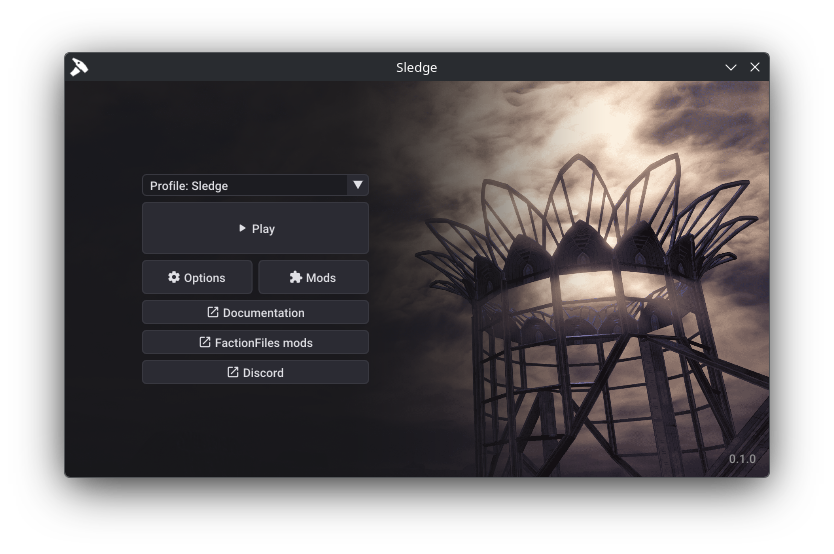

# Index

Sledge is a modification and modding tool for Red Faction: Guerrilla Re-Mars-tered.

-   :lucide-scroll-text:{ .top } __For players__ [<small>Read more :octicons-arrow-right-24:{ .middle }</small>](guides/players/installing-sledge)

    Information for players on how to install and use Sledge.
    
-   :lucide-hammer:{ .top } __For developers__ [<small>Read more :octicons-arrow-right-24:{ .middle }</small>](guides/developers/creating-your-mod/)

    Information for developers on how to create, convert, and publish mods.

## Key features

- Built-in mod manager and Lua scripting API.
- Modern mod format utilising TOML for metadata and Lua for scripting.
- File overriding and XML editing without permanently overwriting files or requiring backups.
- Disables loading `table.vpp_pc` to prevent the game from overriding modded files.

## Planned features

- Bug fixes and stability improvements.
- Enhancements to the base vanilla experience.
- Customisable memory pool sizes to allow for more content.
- Built-in map editor for singleplayer and multiplayer.
- Extract and view game files without needing external tools.
- Bring the Lua scripting API to feature parity with the game's `.scriptx` language.
- Remove the need to work with the game's proprietary file formats.